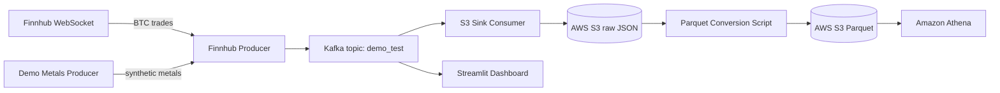
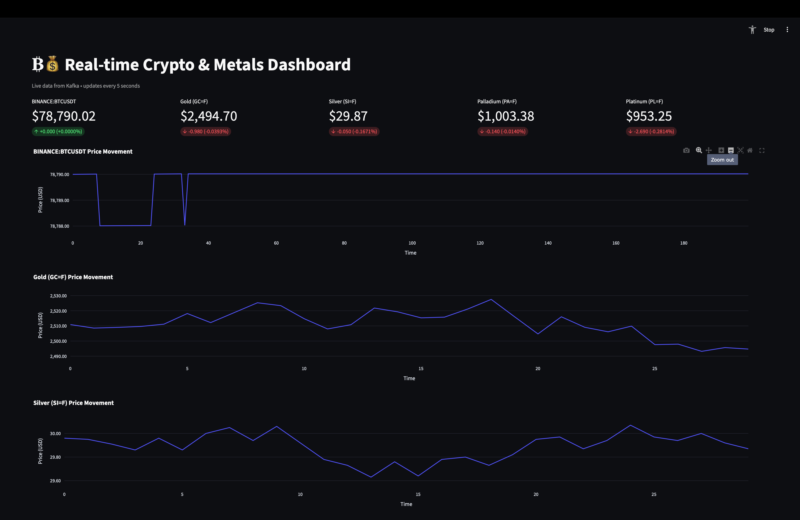

# Real-Time Crypto & Metals Data Pipeline

An end-to-end streaming data pipeline that ingests real-time market data, stores it in a data lake on AWS S3, and visualizes live prices in a Streamlit dashboard. The optional batch layer converts raw S3 JSON files into Apache Parquet for efficient SQL analytics with Amazon Athena.

> Built as a portfolio project for a junior data engineering role.

---

## Architecture



---

## Tech Stack

| Layer | Tool |
|-------|------|
| Cloud Compute | AWS EC2 (t2.micro) |
| Streaming | Apache Kafka + Zookeeper |
| Real-Time Data | Finnhub WebSocket API |
| Object Storage | AWS S3 |
| Dashboard | Streamlit + Plotly |
| Batch Conversion | Python, pandas, PyArrow, boto3 |
| Analytics | Amazon Athena |

---

## Project Structure

```text
kafka-stock-market-portfolio/
├── .gitignore
├── README.md
├── requirements.txt
├── producers/
│   ├── finnhub_producer.py      # Streams BTC from Finnhub → Kafka
│   └── demo_metals_producer.py  # Streams synthetic metals → Kafka
├── consumers/
│   └── s3_consumer_boto3.py     # Kafka → S3 (raw JSON)
├── dashboard/
│   └── dashboard.py             # Streamlit live dashboard
└── scripts/
    ├── start_all.sh             # Start all services
    ├── stop_all.sh              # Stop all services
    └── s3_json_to_parquet.py    # Batch conversion to Parquet
```

---

## Screenshots

### Live Dashboard


### Athena Query


---

## Prerequisites

- An AWS account with an EC2 instance (t2.micro is enough for testing).
- Finnhub API key (free tier).
- Kafka 3.8.0 installed on the EC2 instance.
- Python 3.9+ with `pip`.

---

## Local Setup

Clone the repo and install dependencies:

```bash
git clone https://github.com/YOUR_USERNAME/kafka-stock-market-portfolio.git
cd kafka-stock-market-portfolio
pip install -r requirements.txt
```

Create a `.env` file on the EC2 instance (never commit this):

```bash
FINNHUB_API_KEY=your_finnhub_api_key
S3_BUCKET_NAME=your_s3_bucket_name
KAFKA_BROKER=localhost:9092
KAFKA_TOPIC=demo_test
```

---

## EC2 Setup

1. Launch an Ubuntu/Amazon Linux 2 EC2 instance.
2. Open ports `22` (SSH), `2181` (Zookeeper), `9092` (Kafka), and `8501` (Streamlit) in the security group.
3. Attach an IAM role to the instance that allows `s3:PutObject`, `s3:GetObject`, and `s3:ListBucket`.
4. Install Kafka and Python dependencies:

```bash
pip install -r requirements.txt
```

5. Copy all project files to the EC2 instance, e.g. under `~/kafka-stock-market-portfolio/`.

---

## Running the Pipeline

On EC2, from the project directory:

```bash
bash scripts/start_all.sh
```

This starts, in order:
1. Zookeeper
2. Kafka broker
3. Finnhub BTC producer
4. Demo metals producer
5. S3 sink consumer
6. Streamlit dashboard

Open the dashboard in your browser:

```text
http://YOUR_EC2_PUBLIC_IP:8501
```

To stop everything:

```bash
bash scripts/stop_all.sh
```

Check logs:

```bash
tail -f ~/kafka.log ~/bitcoin_producer.log ~/s3_consumer.log ~/dashboard.log
```

---

## Phase 3: Convert S3 JSON to Parquet & Query with Athena

### 1. Run the conversion script

```bash
python3 scripts/s3_json_to_parquet.py
```

This reads raw JSON from `s3://YOUR_BUCKET/raw/YYYY/MM/DD/`, normalizes the records, and writes partitioned Parquet files to `s3://YOUR_BUCKET/parquet/date=YYYY-MM-DD/`.

### 2. Create an Athena table

In the Athena query editor, create a database and table:

```sql
CREATE DATABASE IF NOT EXISTS stock_market;

CREATE EXTERNAL TABLE IF NOT EXISTS stock_market.trades (
  symbol string,
  price double,
  volume double,
  timestamp_ms bigint,
  source string,
  event_time timestamp
)
PARTITIONED BY (date string)
ROW FORMAT SERDE 'org.apache.hadoop.hive.ql.io.parquet.serde.ParquetHiveSerDe'
STORED AS INPUTFORMAT 'org.apache.hadoop.hive.ql.io.parquet.MapredParquetInputFormat'
OUTPUTFORMAT 'org.apache.hadoop.hive.ql.io.parquet.MapredParquetOutputFormat'
LOCATION 's3://YOUR_BUCKET_NAME/parquet/'
TBLPROPERTIES ('parquet.compress'='SNAPPY');
```

Then add the partition:

```sql
MSCK REPAIR TABLE stock_market.trades;
```

Or use an AWS Glue Crawler pointing to `s3://YOUR_BUCKET_NAME/parquet/` to auto-create the table.

### 3. Sample Athena Queries

Latest 10 trades:

```sql
SELECT symbol, price, volume, event_time
FROM stock_market.trades
ORDER BY event_time DESC
LIMIT 10;
```

Average BTC price per minute:

```sql
SELECT date_trunc('minute', event_time) AS minute,
       avg(price) AS avg_price,
       count(*) AS trade_count
FROM stock_market.trades
WHERE symbol = 'BINANCE:BTCUSDT'
GROUP BY 1
ORDER BY 1 DESC;
```

---

## Cost Warning

Running this stack on AWS can incur charges:

- EC2 t2.micro: free tier eligible for 12 months.
- S3 storage: cheap for small volumes.
- Athena queries: pay-per-scan (~$5/TB).

Remember to run `scripts/stop_all.sh` and delete the EC2 instance when not needed.

---

## What I Learned

- Setting up and configuring a single-node Kafka + Zookeeper cluster on AWS EC2.
- Streaming real-time data via WebSocket into Kafka.
- Persisting streaming data to S3 with a Python consumer.
- Building a live dashboard with Streamlit and Plotly.
- Converting semi-structured JSON into columnar Parquet for analytics.
- Querying a data lake with Amazon Athena.

---

## License

MIT
