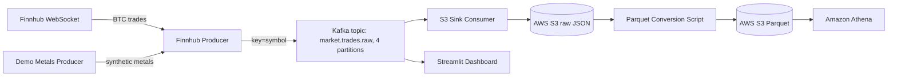
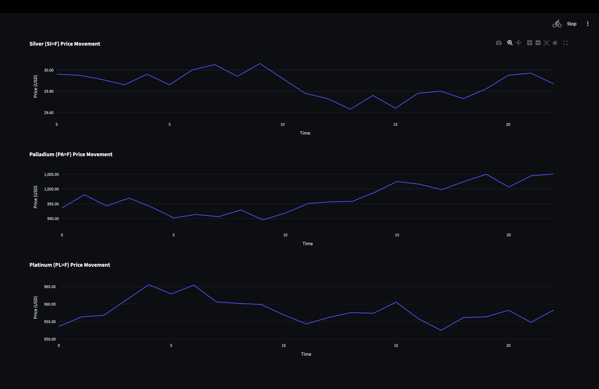
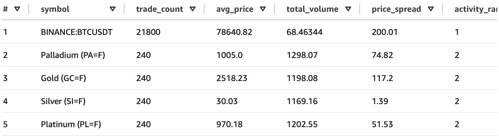
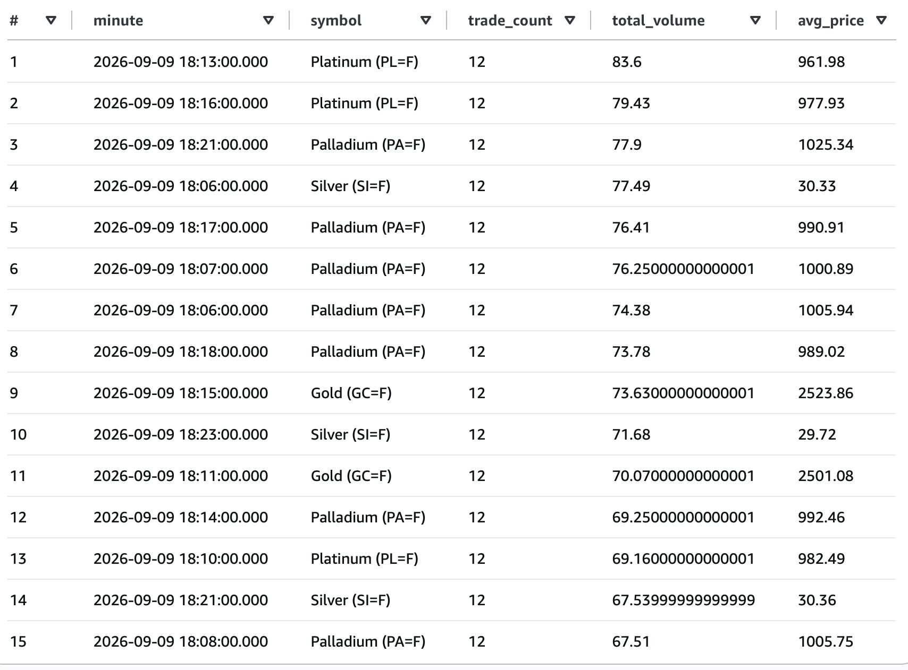
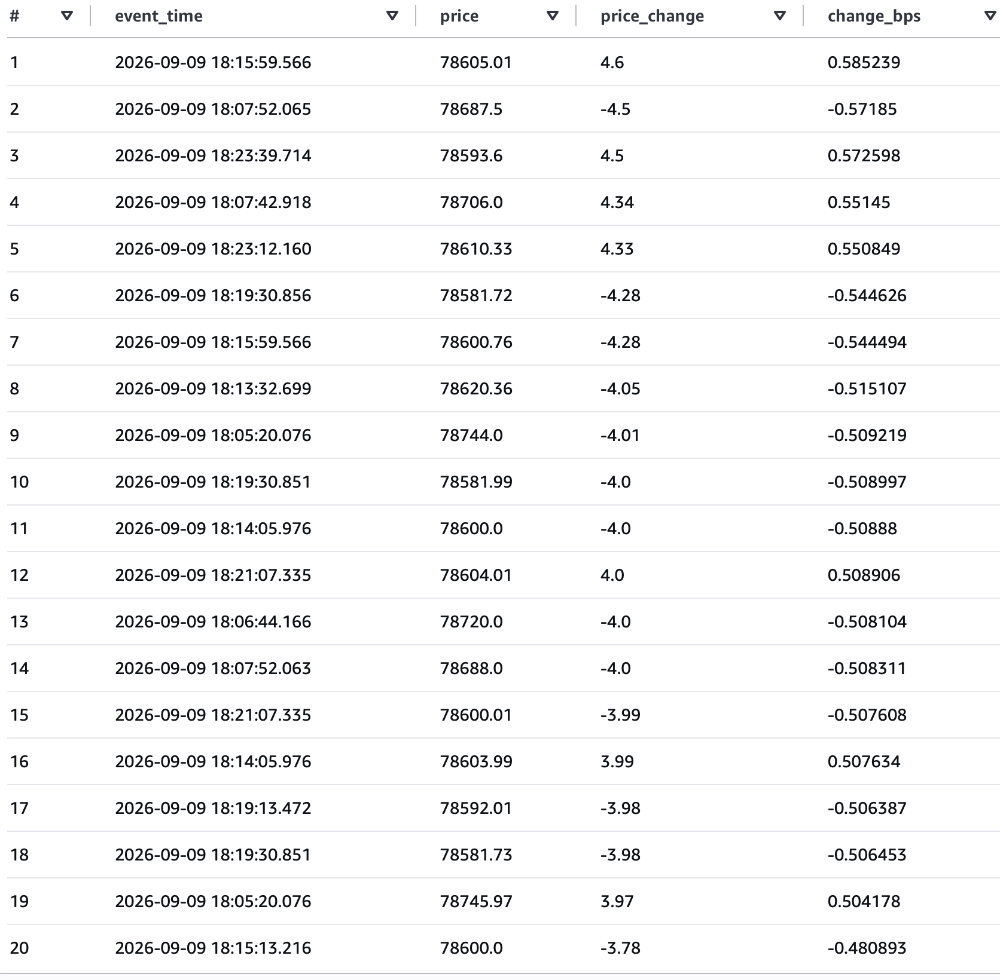

# Real-Time Crypto & Metals Data Pipeline


A production-inspired real-time market data platform demonstrating event streaming, cloud object storage, analytical processing, and real-time visualization. It ingests live BTC trades from Finnhub and synthetic precious-metals ticks, streams them through Apache Kafka, persists them to AWS S3, and serves live dashboards via Streamlit. The optional batch layer converts raw S3 JSON files into Apache Parquet for efficient SQL analytics with Amazon Athena.

---

## Architecture



---

## Tech Stack

| Layer | Tool |
|-------|------|
| Cloud Compute | AWS EC2 (t2.micro) |
| Streaming | Apache Kafka + Zookeeper |
| Real-Time Data | Finnhub WebSocket API |
| Object Storage | AWS S3 |
| Dashboard | Streamlit + Plotly |
| Batch Conversion | Python, pandas, PyArrow, boto3 |
| Analytics | Amazon Athena |

---

## Project Structure

```text
real-time-market-data-platform/
├── .github/
│   └── workflows/
│       └── ci.yml               # GitHub Actions CI
├── .gitignore
├── README.md
├── requirements.txt
├── schema.py                    # Pydantic schema for MarketTradeEvent
├── tests/                       # pytest test suite
├── producers/
│   ├── finnhub_producer.py      # Streams BTC from Finnhub → Kafka (keyed by symbol)
│   └── demo_metals_producer.py  # Streams synthetic metals → Kafka (keyed by symbol)
├── consumers/
│   └── s3_consumer_boto3.py     # Kafka → S3 with retries + DLQ
├── dashboard/
│   └── dashboard.py             # Streamlit live dashboard with consumer reconnect
└── scripts/
    ├── start_all.sh             # Start all services
    ├── stop_all.sh              # Stop all services
    ├── create_topic.py          # Create market.trades.raw topic (4 partitions) + DLQ topic
    └── s3_json_to_parquet.py    # Batch conversion to Parquet
```

---

## Screenshots

### Live Dashboard


### Live Dashboard with Multiple Assets


### Athena Query


More advanced Athena analysis is shown in the [Advanced Analysis](#4-advanced-analysis) section.

---

## Prerequisites

- An AWS account with an EC2 instance (t2.micro is enough for testing).
- Finnhub API key (free tier).
- Kafka 3.8.0 installed on the EC2 instance.
- Python 3.9+ with `pip`.

---

## Local Setup

Clone the repo and install dependencies:

```bash
git clone https://github.com/DenitsaNes/Kafka-stock-market.git
cd kafka-stock-market-portfolio
pip install -r requirements.txt
```

Create a `.env` file on the EC2 instance (never commit this):

```bash
FINNHUB_API_KEY=your_finnhub_api_key
S3_BUCKET_NAME=your_s3_bucket_name
KAFKA_BROKER=localhost:9092
KAFKA_TOPIC=market.trades.raw
```

---

## EC2 Setup

1. Launch an Ubuntu/Amazon Linux 2 EC2 instance.
2. Open ports `22` (SSH), `2181` (Zookeeper), `9092` (Kafka), and `8501` (Streamlit) in the security group.
3. Attach an IAM role to the instance that allows `s3:PutObject`, `s3:GetObject`, and `s3:ListBucket`.
4. Install Kafka and Python dependencies:

```bash
pip install -r requirements.txt
```

5. Copy all project files to the EC2 instance, e.g. under `~/real-time-market-data-platform/`.

---

## Running the Pipeline

On EC2, from the project directory:

```bash
bash scripts/start_all.sh
```

This starts, in order:
1. Zookeeper
2. Kafka broker
3. Kafka topic `market.trades.raw` (4 partitions)
4. Finnhub BTC producer
5. Demo metals producer
6. S3 sink consumer
7. Streamlit dashboard

Open the dashboard in your browser:

```text
http://YOUR_EC2_PUBLIC_IP:8501
```

To stop everything:

```bash
bash scripts/stop_all.sh
```

Check logs:

```bash
tail -f ~/kafka.log ~/bitcoin_producer.log ~/s3_consumer.log ~/dashboard.log
```

---

## Phase 3: Convert S3 JSON to Parquet & Query with Athena

### 1. Run the conversion script

```bash
set -a
source ~/.env
set +a
python3 scripts/s3_json_to_parquet.py
```

This reads raw JSON from `s3://YOUR_BUCKET/raw/YYYY/MM/DD/`, normalizes the records, and writes partitioned Parquet files to `s3://YOUR_BUCKET/parquet/date=YYYY-MM-DD/`.

### 2. Create an Athena table

In the Athena query editor, create a database and table:

```sql
CREATE DATABASE IF NOT EXISTS stock_market;

CREATE EXTERNAL TABLE IF NOT EXISTS stock_market.trades (
  symbol string,
  price double,
  volume double,
  timestamp_ms bigint,
  source string,
  event_time timestamp
)
PARTITIONED BY (date string)
ROW FORMAT SERDE 'org.apache.hadoop.hive.ql.io.parquet.serde.ParquetHiveSerDe'
STORED AS INPUTFORMAT 'org.apache.hadoop.hive.ql.io.parquet.MapredParquetInputFormat'
OUTPUTFORMAT 'org.apache.hadoop.hive.ql.io.parquet.MapredParquetOutputFormat'
LOCATION 's3://YOUR_BUCKET_NAME/parquet/'
TBLPROPERTIES ('parquet.compress'='SNAPPY');
```

Then add the partition:

```sql
MSCK REPAIR TABLE stock_market.trades;
```

Or use an AWS Glue Crawler pointing to `s3://YOUR_BUCKET_NAME/parquet/` to auto-create the table.

### 3. Sample Athena Queries

#### Latest 10 trades

```sql
SELECT symbol, price, volume, event_time
FROM stock_market.trades
ORDER BY event_time DESC
LIMIT 10;
```

#### Average BTC price per minute

```sql
SELECT date_trunc('minute', event_time) AS minute,
       avg(price) AS avg_price,
       count(*) AS trade_count
FROM stock_market.trades
WHERE symbol = 'BINANCE:BTCUSDT'
GROUP BY 1
ORDER BY 1 DESC;
```

### 4. Advanced Analysis

These queries use window functions and ranking to answer real business questions.

#### Which assets traded the most?

```sql
SELECT symbol,
       count(*) AS trade_count,
       round(avg(price), 2) AS avg_price,
       round(sum(volume), 6) AS total_volume,
       round(max(price) - min(price), 2) AS price_spread,
       RANK() OVER (ORDER BY count(*) DESC) AS activity_rank
FROM stock_market.trades
GROUP BY symbol
ORDER BY activity_rank;
```



#### Which minute had the highest trading volume?

```sql
SELECT date_trunc('minute', event_time) AS minute,
       symbol,
       count(*) AS trade_count,
       round(sum(volume), 2) AS total_volume,
       round(avg(price), 2) AS avg_price
FROM stock_market.trades
GROUP BY date_trunc('minute', event_time), symbol
ORDER BY sum(volume) DESC
LIMIT 15;
```



#### How much does Bitcoin price jump between trades?

```sql
WITH btc_trades AS (
  SELECT event_time,
         price,
         lag(price) OVER (ORDER BY event_time) AS prev_price
  FROM stock_market.trades
  WHERE symbol = 'BINANCE:BTCUSDT'
)
SELECT event_time,
       price,
       round(price - prev_price, 4) AS price_change,
       round((price - prev_price) / prev_price * 100, 6) AS change_pct
FROM btc_trades
WHERE prev_price IS NOT NULL
ORDER BY event_time DESC
LIMIT 20;
```



---

## Cost Warning

Running this stack on AWS can incur charges. AWS pricing and free-tier eligibility change over time, so always check the current AWS pricing pages before launching resources:

- EC2 instance: charged by the hour while the instance is running.
- S3 storage and requests: charged based on storage size, object count, and data transfer.
- Athena queries: pay-per-scan (~$5/TB at the time of writing).

To avoid unexpected charges, run `scripts/stop_all.sh` and terminate the EC2 instance when it is not in use.

---

## Running Tests

Tests run with `pytest` and do not require Kafka or AWS to be running.

```bash
pip install -r requirements.txt
pytest tests/ -v
```

GitHub Actions runs the test suite on Python 3.10, 3.11, and 3.12 on every push to `main`.

---

## What I Learned

- Setting up and configuring a single-node Kafka + Zookeeper cluster on AWS EC2.
- Streaming real-time data via WebSocket into Kafka.
- Validating streaming events with a Pydantic schema.
- Persisting streaming data to S3 with a Python consumer.
- Building a live dashboard with Streamlit and Plotly.
- Converting semi-structured JSON into columnar Parquet for analytics.
- Querying a data lake with Amazon Athena.

---

## License

MIT
